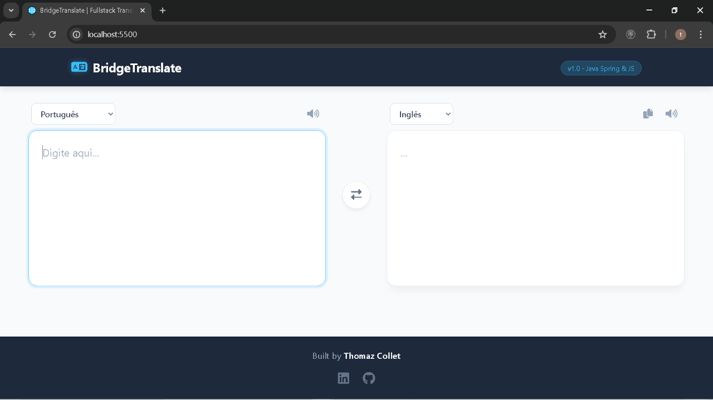
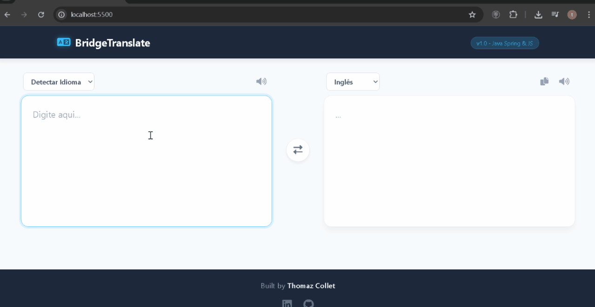
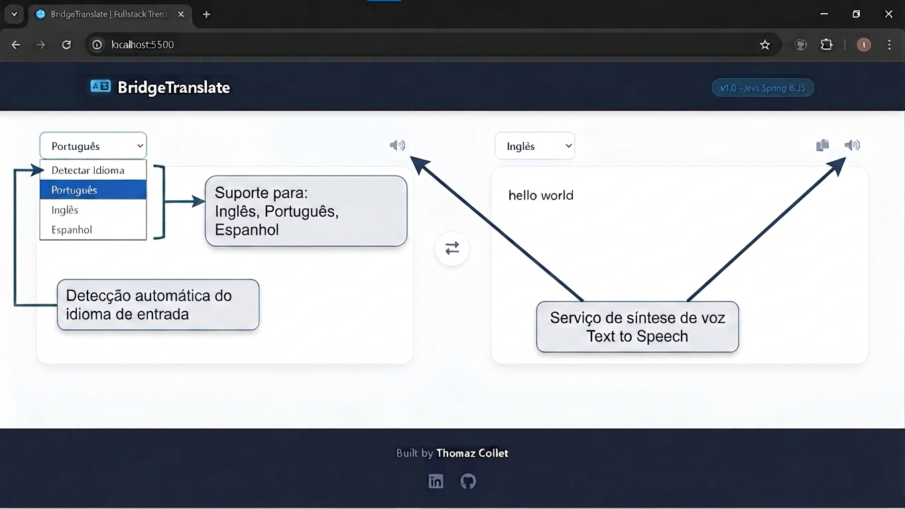

# BridgeTranslate — Fullstack Dockerized API



*Interface principal limpa e responsiva, focada na experiência do usuário.*

### Sobre o Projeto
O BridgeTranslate é um ecossistema completo de tradução desenvolvido com intuito educacional para aplicar conhecimentos e demonstrar habilidades em Java Spring Boot, orquestração de infraestrutura com Docker e integração de serviços de alto desempenho.

A aplicação permite tradução instantânea e síntese de voz (TTS) entre Português, Inglês e Espanhol, utilizando um motor de tradução self-hosted para reduzir a dependência de APIs externas pagas.


### Demonstração em Ação

*Exemplo de tradução em tempo real. Clique para reproduzir!*

---

### Tecnologias e Diferenciais Técnicos
* **Backend:** Java 17 com Spring Boot 3, utilizando boas práticas como Fail-Fast e tratamento de exceções personalizado.
* **Motores de Serviço:** Integração com LibreTranslate para tradução local e VoiceRSS para síntese de voz.
* **Cache e Performance:** Redis integrado para persistência temporária, otimizando o tempo de resposta para traduções recorrentes.
* **Frontend:** Interface moderna desenvolvida com JavaScript Vanilla, HTML5 e CSS3, servida via Nginx.
* **Infraestrutura:** Orquestração completa via Docker Compose, garantindo que todo o ambiente (API, Tradutor, Redis e Web) suba com um único comando.
* **Documentação:** API documentada de forma interativa com Swagger (OpenAPI 3).

---

### Funcionalidades Principais


1. **Tradução Poliglota:** Suporte nativo para Português, Inglês e Espanhol.
2. **Síntese de Voz:** Integração com API de áudio para pronúncia precisa dos textos traduzidos.
3. **Arquitetura Dockerizada:** Isolamento de processos e facilidade de deploy em diferentes ambientes.

---

### Instruções para Execução
O projeto foi desenhado para ser portável e de fácil inicialização.

**Pré-requisitos:**
* **Docker Desktop** instalado e em execução.
* **Conexão com a internet:** Necessária para o download inicial das imagens no Docker Hub, download dos modelos de tradução (EN, PT, ES) pelo motor local e comunicação com a API de síntese de voz.

**Passo a passo:**
1.  Clone o repositório em sua máquina local.
2.  Na raiz do projeto (onde se encontra o arquivo `docker-compose.yml`), execute o comando:
    ```bash
    docker-compose up -d
    ```
3.  Aguarde alguns instantes para o download e inicialização dos serviços (o motor de tradução pode levar cerca de 1 minuto para carregar os modelos na primeira execução).
4.  Acesse a interface web em: [http://localhost:5500](http://localhost:5500).
5.  **Documentação da API:** Explore todos os endpoints via Swagger UI em: [http://localhost:8080/swagger-ui.html](http://localhost:8080/swagger-ui.html).

---

### 🤝 Conecte-se comigo

Para mais detalhes sobre este e outros projetos de Engenharia de Software:

* **LinkedIn:** <a href="https://www.linkedin.com/in/thomaz-collet" target="_blank">linkedin.com/in/thomaz-collet</a>
* **GitHub:** <a href="https://github.com/ThomazCollet" target="_blank">github.com/ThomazCollet</a>
* **Portfólio Pessoal:** <a href="https://thomazcollet.github.io/Portfolio-trabalho/" target="_blank">thomazcollet.github.io/Portfolio-trabalho</a>
---

### 📄 Licença

Este projeto está licenciado sob a Licença MIT. Você é livre para usar, copiar, modificar e distribuir este software, desde que os devidos créditos sejam atribuídos.
